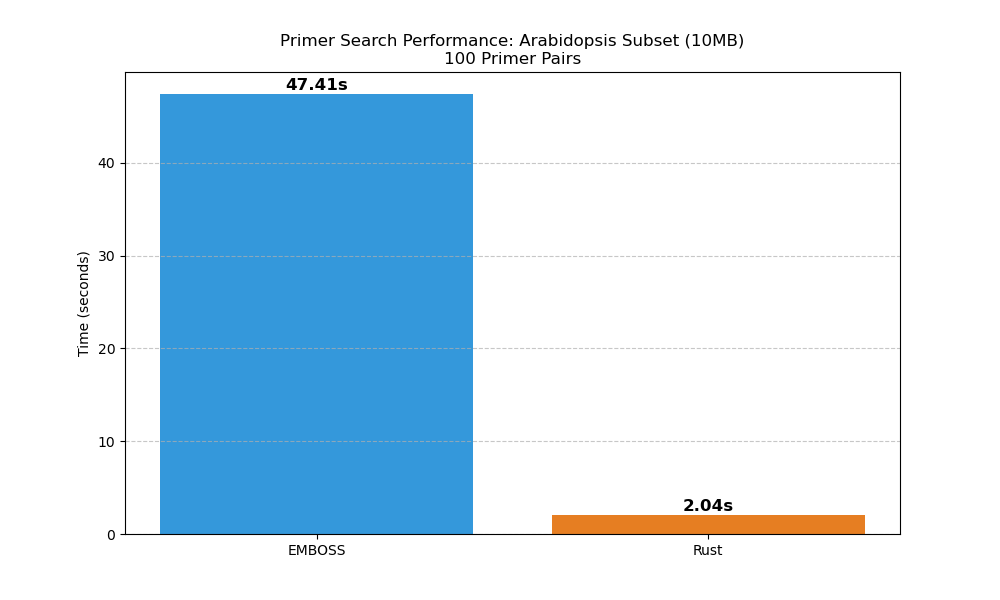
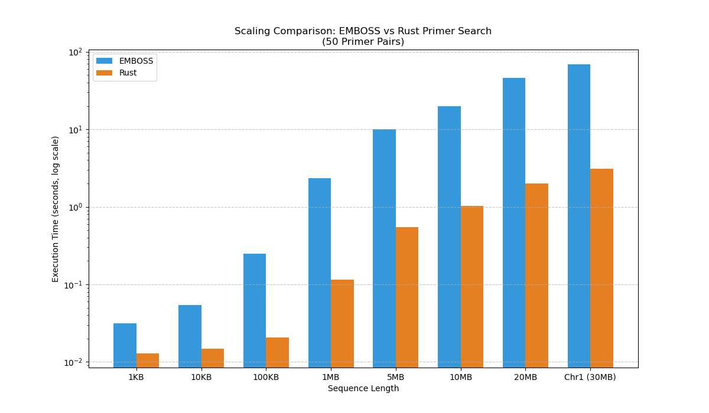

# primersearch-rs

A fast, parallelized Rust implementation of the EMBOSS `primersearch` tool.

## Overview

`primersearch-rs` is designed to find potential amplimers (PCR products) in genomic sequences using a set of primer pairs. It maintains compatibility with the EMBOSS `primersearch` input and output formats while providing significant performance improvements through Rust's safety and concurrency features.

### Key Features:
- **High Performance:** Significantly faster than the original EMBOSS implementation, especially on large genomes.
- **Parallel Processing:** Utilizes multiple CPU cores to search for primers in parallel using `rayon`.
- **EMBOSS Compatible:** Supports standard primer files (Name\tForward\tReverse) and produces familiar output.
- **Memory Efficient:** Optimized sequence loading and matching.

## Installation

Ensure you have [Rust and Cargo](https://rustup.rs/) installed.

```bash
git clone https://github.com/yourusername/primersearch-rs.git
cd primersearch-rs
cargo build --release
```

The binary will be located at `target/release/primersearch-rs`.

## Usage

```bash
./target/release/primersearch-rs --seqall <genome.fasta> --infile <primers.txt> --outfile <results.out> --mismatchpercent 0
```

### Arguments:
- `-s, --seqall`: Path to the input FASTA file (genome or sequences).
- `-i, --infile`: Path to the primer file. Format: `Name\tForward\tReverse`.
- `-o, --outfile`: Path to the output file where results will be written.
- `-m, --mismatchpercent`: Maximum allowed mismatch percentage (default: 0).

## Benchmarking

`primersearch-rs` was benchmarked against the standard EMBOSS `primersearch` (v6.6.0) using various datasets.

### Arabidopsis Genome Subset (10MB)
Using 100 primer pairs against a 10MB subset of the *Arabidopsis thaliana* genome.



*Results:* Rust version shows a significant speedup over EMBOSS on realistic genomic data.

### Scaling Performance
We tested the scaling performance by increasing the sequence size from 1KB to 30MB (Chromosome 1 of Arabidopsis) with 50 primer pairs.



*Note:* The Y-axis is in log scale. As the sequence size increases, the performance gap between EMBOSS and `primersearch-rs` widens dramatically, with the Rust implementation completing tasks in seconds that take EMBOSS much longer.

## License

[MIT](LICENSE) (or specify your license)
